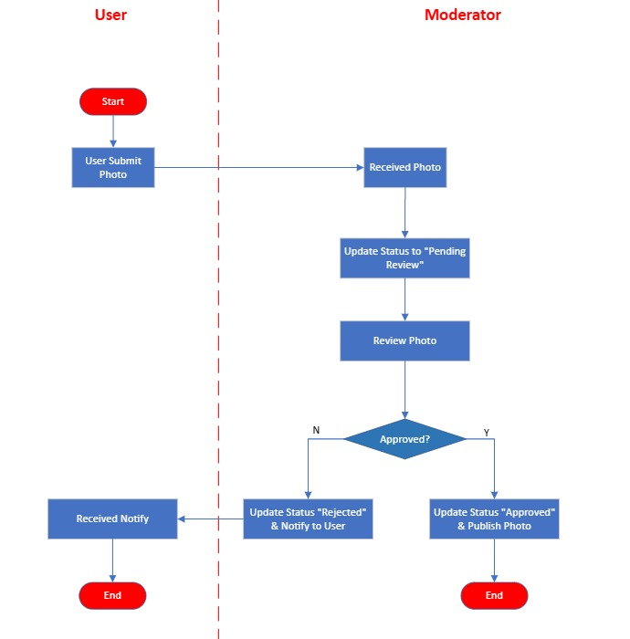

## Actors
- **User (Submitter)** – uploads photos to the platform
- **Moderator (Reviewer)** – reviews and approves/rejects photos.
- **System** – handles storage, status transitions, and notifications.

---
## Photo States
| State     | Description |
|-----------|-------------|
| `draft`   | (Optional) User uploaded but not yet submitted for review |
| `pending` | Waiting for moderator review |
| `approved`| Reviewed and published, visible to public |
| `rejected`| Reviewed but not published, hidden from public |
---

## Workflow
**1. Submission Phase**
- User uploads photo → stored in object storage (S3, R2, etc.).
- Metadata stored in DB (status = pending).
- System notifies moderator dashboard / queue.

**2. Moderation Phase**
- Moderator sees all pending items.
- For each photo, moderator chooses:
✅ Approve → status → approved → photo published.
❌ Reject → status → rejected → user optionally notified with reason.

**3. Publishing Phase**
_Only photos with status = "approved" are shown in:_
- Public gallery
- User profile
- Search results / feeds

**4. Feedback / Audit**
_Store moderation logs:_
- photo_id
- moderator_id
- decision (approved/rejected)
- notes
- created_at

---

### if I were to build this MVP quickly, I’d use:
Backend: Go + Fiber
DB: mysql
Storage: Cloudflare R2 (S3-compatible, cheap).
Admin Panel: Laravel
---

## UML Diagram
